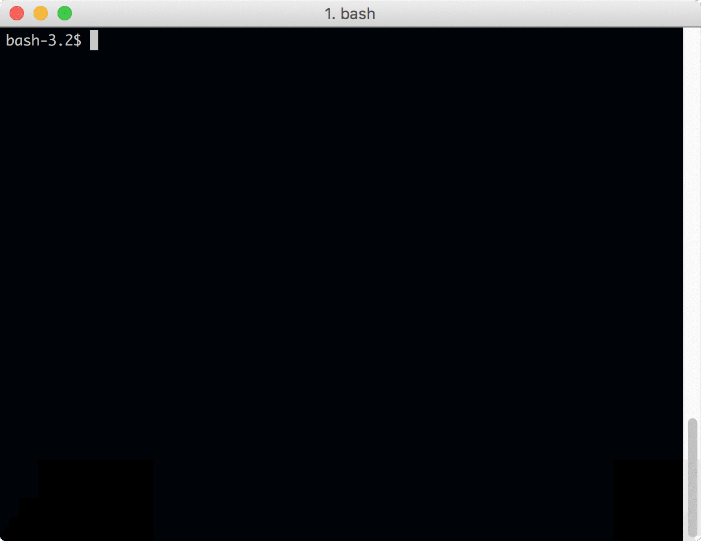

# CPA Visual Studio Code Workflow Tool - in Development

*Last Update: Aug 11 2017. Currently working on: re-organize app and adjust paths*

This tool is built on node.js to let user finish cascade development workflow inside visual studio code.

For detailed workflow, please check **cascade** project in Basecamp. See **Document** section for detail.

- [CPA Visual Studio Code Workflow Tool - in Development](#cpa-visual-studio-code-workflow-tool---in-development)
    - [Environment](#environment)
    - [Cascade RESTFUL API Objects - Each has corresponding method](#cascade-restful-api-objects---each-has-corresponding-method)
    - [How to use program](#how-to-use-program)
    - [Introduction](#introduction)
        - [Cascade API](#cascade-api)
        - [Gulp](#gulp)
            - [Order of gulp.js](#order-of-gulpjs)
            - [Todos](#todos)
        - [Log](#log)
            - [Todos](#todos)
        - [Github](#github)
            - [Todos](#todos)
    - [Reference Sites](#reference-sites)

## Environment

- `node.js`: version 6

- Run `npm install` to install node modules in `package.json`

- Due to an existing bug with array, use **0.1.16** for `node-dir`

## Cascade RESTFUL API Objects - Each has corresponding method

- `file`: `css`/`js`/`image`

- `format_SCRIPT`: `vm`

- `format_XSLT`: `xslt`

- `folder`

- `page`

## How to use program

For internal process, see <a href="#gulp">gulp</a> part. 

## Introduction 

### Cascade API

- *Till Aug 11th, apis that work:* file (`css`, `js`, `image`,etc), folder, script (`vm`), xslt(`xslt`)

- May want to add api in the future: page

### Gulp

#### Order of gulp.js

1. Initialize: re-create destination folder if needed

2. Local - Process file: for **selected** folder in `src` folder, process files based on file type, then move file to destination folder

3. Remote - Compare **each** file in same location remotely and locally. **If a file only exists in remote server, delete it remotely.**

4. Remote - For **each** file in destination folder, overwrite the content of its remote sibling in remote server

#### Todos

- **Problem2**: after re-adjusting folder structure, the 'no such file or directory problem comes back'.

- Some files which has been deleted still show in REST Read method. See `https://3.basecamp.com/3247301/buckets/752581/todos/614344069`. *Due this problem, process.deleteProcess has no reject temporary. This will be fixed after moving to next version*.

- Merge gulp task with pattern lab

- Find way to execute back

- Add methods to validate file type in folders

### Log

- Using `winston` library to log actions: https://github.com/winstonjs/winston

- Logger configuration is in `logger.js`

- Log is recorded on both console and `logfile.log` file - this file is created automatically if not found in system

#### Todos

- **Problems**: output error in promise for folder without deletion

- Custom formatter is only used in file logging. Colorize and Custom Level are not work if custom formatter is used. Should console being configured to custom formatter also?

- Check formatter - where else we want to add log?

- Do we want to split log between info and debug?

### Github

- Currently no Github integration is used app

#### Todos

- Add Github integration to app: automatically check if the code is up-to-date in Github. If no, stop app. 

## Reference Sites

- Cascade RESTFUL API: https://www.hannonhill.com/cascadecms/8/kb/developing-in-cascade/rest-api/index.html

