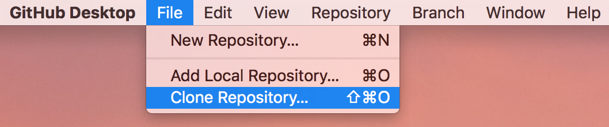

# CPA Visual Studio Code Workflow Tool - in Development

The first version of **Cascade RESTFul Visual Studio Code Tool** is written on summer 2017. 

The goal of this tool is to free developers from writing/debugging code directly inside Cascade 8 server. Instead, developer write code in Visual Studio Code (_VS Code_), then use this tool to pass code to Cascade 8 server. This tool serves as a middleware between developer's local machine and Cascade 8 Server.

Please see right menu for instructions and development notes.

- [CPA Visual Studio Code Workflow Tool - in Development](#cpa-visual-studio-code-workflow-tool---in-development)
    - [Setup](#setup)
        - [1. Install node.js on your machine](#1-install-nodejs-on-your-machine)
        - [2. Install Github Desktop on your machine](#2-install-github-desktop-on-your-machine)
        - [3. Clone repository to your machine](#3-clone-repository-to-your-machine)
        - [4. Install node package on your machine](#4-install-node-package-on-your-machine)
    - [How to Use](#how-to-use)
    - [Structure of Program](#structure-of-program)
        - [Cascade API](#cascade-api)
            - [Future Plan](#future-plan)
        - [Gulp](#gulp)
            - [Order of gulp.js](#order-of-gulpjs)
            - [Future Plan](#future-plan)
        - [Log](#log)
        - [Github](#github)
    - [Reference Sites](#reference-sites)

## Setup

_Example screen videos are recorded on Mac, but guidelines for Windows environment are also provided in words._

### 1. Install node.js on your machine

- Mac & Windows: go to [https://nodejs.org/en/](https://nodejs.org/en/) and download **LTS** version of Node.js. Install it on your machine. (*You may need administration right to install this*)

### 2. Install Github Desktop on your machine

1. Make sure you have a Github work account. Please check Basecamp for details.

2. Mac & Windows: go to [https://desktop.github.com/](https://desktop.github.com/) and download Github Desktop. Install it on your machine.

### 3. Clone repository to your machine

3. Open Github Desktop. In menu, select **File -> Clone Repository**

4. Enter https://github.com/emorycpa/JSCPA.git in `Repository URL` field, and select a location for this repository. Then click `Clone` to clone repository

5. Open Visual Studio Code, then open integrated terminal by selecting `View -> Integrated Terminal`. If you prefer terminal, you can open your favorite terminal on your machine and navigate to this directory

 

 

 

### 4. Install node package on your machine

6. Run `npm install` in your terminal. Node will automatically install necessary modules for this app, refering `package.json` file in repository. (*You may need administration right to install this*)

If you want to make sure that all modules have been installed successfully, you can run `npm list` to list all installed modules and messages.

## How to Use
 
Just type `gulp` in root directory of repository folder, then enter answers to questions (Type your answer then hit `Enter` on keyboard). You are done!

## Structure of Program

### Cascade API

Code about Cascade API Process can be found in `app/cascade` folder. Each type of cascade item has four operations: `read`, `delete`, `edit` and `write`. The correspondence between local file and remote file type can be found in `data/sitedata.js`.

#### Future Plan 

- Api in the future: `page`

- Solve socket problem for large files

### Gulp

#### Order of gulp.js

1. Initialize: re-create destination folder if needed

2. Local - Process file: for **selected** folder in `src` folder, process files based on file type, then move file to destination folder

3. Remote - Compare **each** file in same location remotely and locally. **If a file only exists in remote server, delete it remotely.**

4. Remote - For **each** file in destination folder, overwrite the content of its remote sibling in remote server

#### Future Plan

- Add progress bar in terminal for gulp process

- Some files which has been deleted still show in REST Read method. See `https://3.basecamp.com/3247301/buckets/752581/todos/614344069`. *Due this problem, process.deleteProcess has no reject temporary. This will be fixed after moving to next version*.

- Merge gulp task with pattern lab

- Find way to execute back

- Add methods to validate file type in folders

### Log

<a href="https://github.com/winstonjs/winston">winston</a> library is used to log actions. 

Logger configuration is in `logger.js`. 

Log is recorded on both terminal and `logfile.log` file - this file is created automatically if not found in system.

The format of log is `action type` + `EST data/time (no daylight saving)` + `your cascade username` + `description of your action`.

There are four actions types currently being used: 

- `info`: action is processed regularly and successfully

- `error`: an error exists in action. Action failed

- `alert`: action is required manually to fix error

- `debug`: this message is only for local debug. **Should be removed before submitting all code to Github**

### Github

Currently, there is no Github integration is used app

## Reference Sites

- Cascade RESTFUL API: https://www.hannonhill.com/cascadecms/8/kb/developing-in-cascade/rest-api/index.html